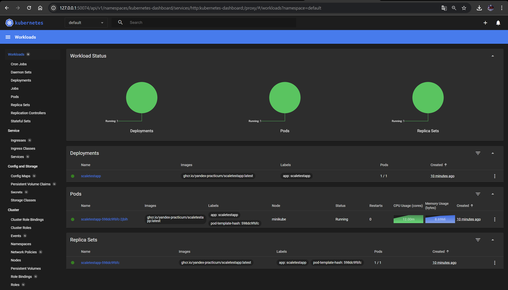
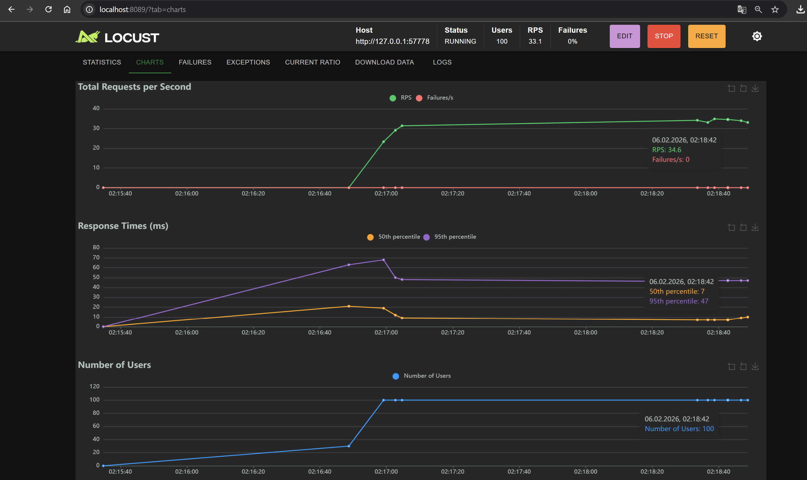
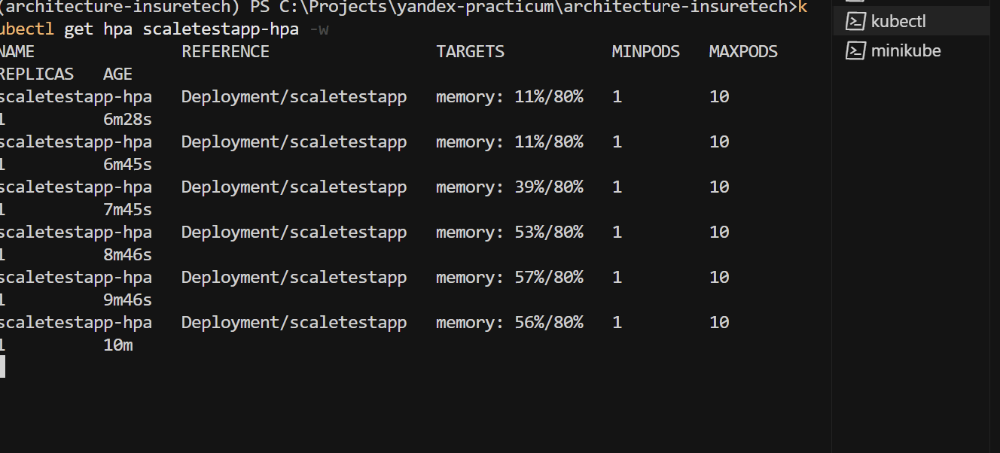
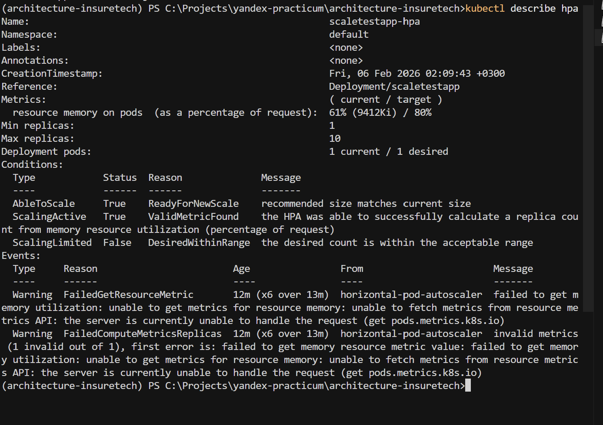
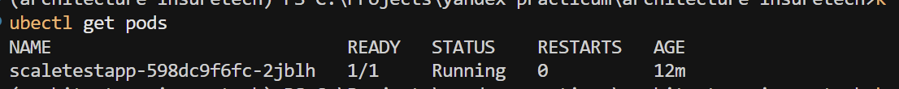

# Проектная работа 8 спринта — InsureTech

---

## Задание 1. Проектирование технологической архитектуры

Файлы в папке Task1:

- [`as-is (puml)`](Task1/InsureTech_технологическая_архитектура_as-is.puml)
- [`to-be (puml)`](Task1/InsureTech_технологическая_архитектура_to-be.puml)
- [`as-is (png)`](Task1/InsureTech_as_is.png)
- [`to-be (png)`](Task1/InsureTech_to_be.png)

### Ключевые решения

- 3 зоны доступности Yandex Cloud (ru-central1-a/b/d)
- Независимые K8s-кластеры в каждой зоне (проще в управлении, чем растянутый)
- Application Load Balancer (L7) с health checks для балансировки и failover (Active-Active)
- CDN для одинакового времени загрузки из всех регионов
- PostgreSQL: Master + Sync Replica + Async Replica, Patroni для автоматического failover
- RPO ≤ 15 мин (синхронная репликация + бэкапы), RTO ≤ 45 мин (авто-failover)
- Шардирование не требуется (50 ГБ данных)

---

## Задание 2. Динамическое масштабирование контейнеров

Команды по запуску и настройке кластера представлены в [Makefile](Makefile).

Файлы в папке Task2:

- [`deployment.yaml`](Task2/deployment.yaml)
- [`service.yaml`](Task2/service.yaml)
- [`hpa.yaml`](Task2/hpa.yaml)
- [`locustfile.py`](Task2/locustfile.py)

### Скриншоты

#### Minikube Dashboard — поды:

#### Locust — нагрузка:

#### HPA статус (kubectl):

#### HPA describe — события rescale (kubectl):

#### Поды (kubectl):

---

## Задание 3. Переход на Event-Driven архитектуру

Файлы в папке Task3:

- [`Проблемы и риски`](Task3/readme.md)
- [`C4-диаграмма (puml)`](Task3/InsureTech_C4_container_diagram_event_driven.puml)
- [`C4-диаграмма (png)`](Task3/InsureTech_C4_container_diagram_event_driven.png)

### Что перевели на Event-Streaming

- **Каталог продуктов/тарифов**: `ins-product-aggregator -> Kafka` (publish), `core-app` и `ins-comp-settlement` подписываются (consume)
- **Оформленные страховки**: `core-app -> Kafka` (publish), `ins-comp-settlement` потребляет вместо ежесуточного REST-запроса
- Рекомендован **Transactional Outbox** для гарантии согласованности

---

## Задание 4. Проектирование продажи ОСАГО

Файлы в папке Task4:

- [`Описание решений`](Task4/readme.md)
- [`C4-диаграмма (puml)`](Task4/InsureTech_C4_OSAGO.puml)
- [`C4-диаграмма (png)`](Task4/InsureTech_C4_OSAGO.png)

### Что сделано

- Добавлен сервис **osago-aggregator** со своей БД
- Обмен core-app <-> osago-aggregator через **Kafka**
- **WebSocket** между Web и core-app для отображения предложений в реальном времени
- Паттерны отказоустойчивости: **Timeout** (60s), **Retry**, **Circuit Breaker**, **Rate Limiting**

---

## Задание 5. Проектирование GraphQL API

Файлы в папке Task5:

- [`schema.graphql`](Task5/schema.graphql)

GraphQL-схема позволяет клиенту за один запрос получить ровно те данные, которые нужны (client + documents + relatives), вместо 3 отдельных REST-вызовов. Решает проблему over-fetching при 500 атрибутах.

---

## Задание 6. Настройка Rate Limiting

Файлы в папке Task6:

- [`nginx.conf`](Task6/nginx.conf)

Добавлен Rate Limiting: не более 10 запросов в минуту на IP. При превышении — HTTP 429.
